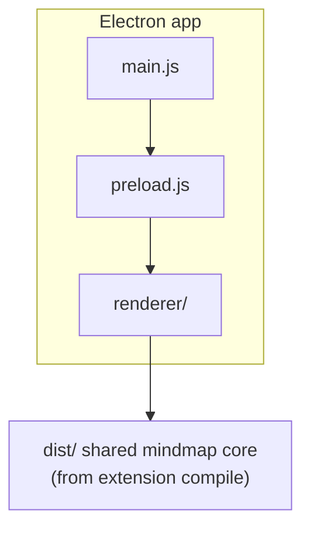

# 组件图（Mermaid）

```mermaid
flowchart TB
  subgraph Desktop["Electron app"]
    MAIN["main.js"]
    PRE["preload.js"]
    REN["renderer/"]
  end
  SHARED["dist/ shared mindmap core\n(from extension compile)"]
  MAIN --> PRE
  PRE --> REN
  REN --> SHARED
```
