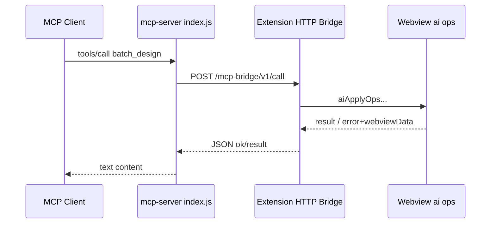

# 组件图（Mermaid）

```mermaid
sequenceDiagram
  participant Client as MCP Client
  participant MCP as mcp-server index.js
  participant Bridge as Extension HTTP Bridge
  participant Web as Webview ai ops
  Client->>MCP: tools/call batch_design
  MCP->>Bridge: POST /mcp-bridge/v1/call
  Bridge->>Web: aiApplyOps...
  Web-->>Bridge: result / error+webviewData
  Bridge-->>MCP: JSON ok/result
  MCP-->>Client: text content
```
