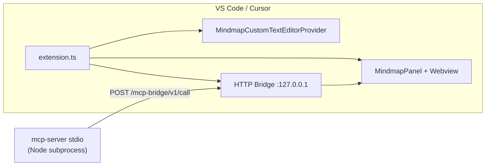

# 组件图（Mermaid）

```mermaid
flowchart LR
  subgraph VSCode["VS Code / Cursor"]
    EXT["extension.ts"]
    CTE["MindmapCustomTextEditorProvider"]
    PNL["MindmapPanel + Webview"]
    BR["HTTP Bridge :127.0.0.1"]
  end
  MCP["mcp-server stdio\n(Node subprocess)"]
  EXT --> CTE
  EXT --> PNL
  EXT --> BR
  MCP -->|POST /mcp-bridge/v1/call| BR
  BR --> PNL
```
